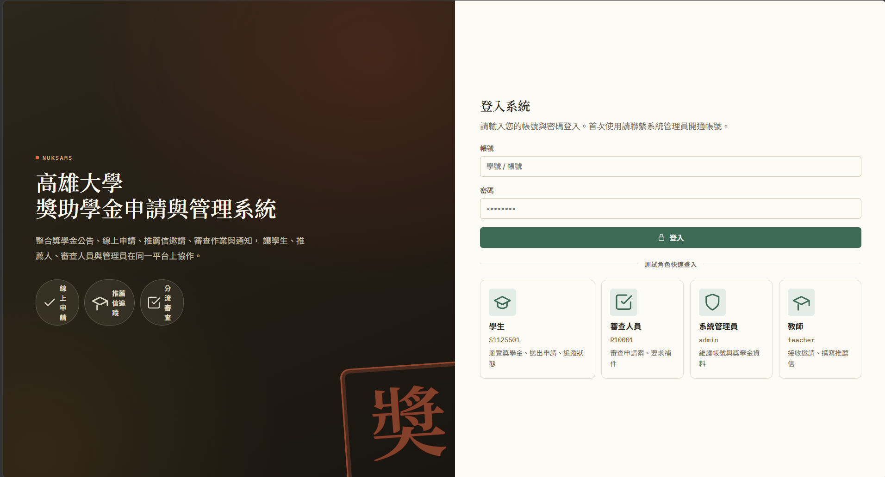
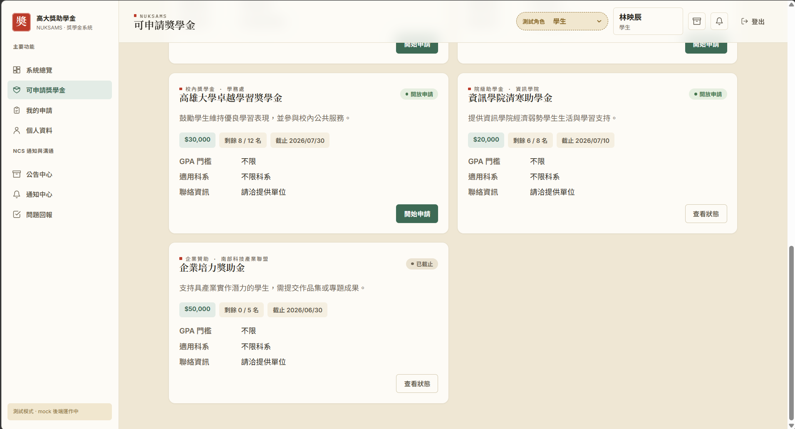
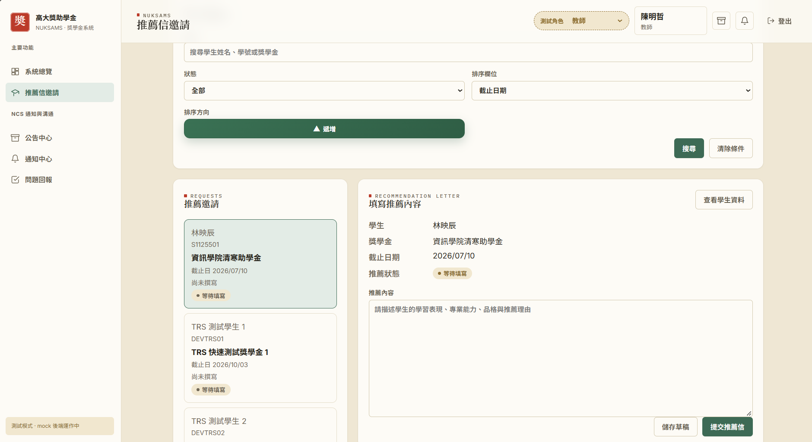
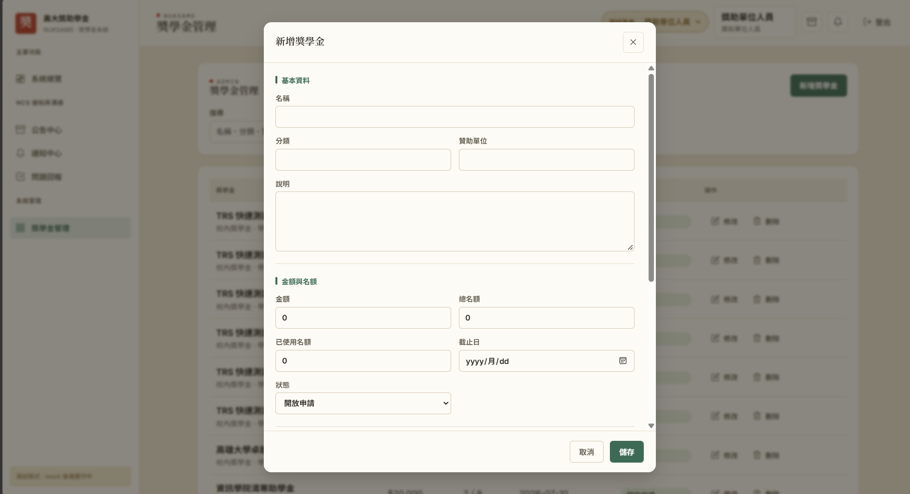
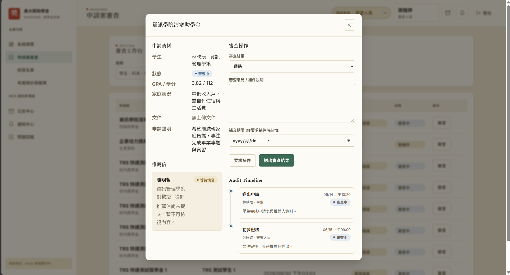
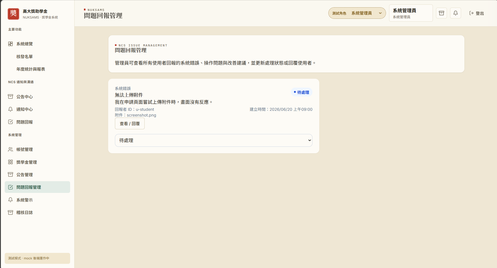

# NUKSAMS｜高雄大學獎（助）學金申請與管理系統

軟體工程期末專案（第 2 組）。此專案將獎助學金的刊登、申請、推薦、審查與通知整合在同一個網頁平台。學生能從查詢獎學金一路追蹤到審查結果；教師、獎助單位人員、審查人員與系統管理員則在各自的工作介面處理相關業務。

## 專案概述

獎助單位建立獎學金並設定金額、名額、資格條件與截止時間。學生查看適合自己的項目後，可以建立申請草稿、填寫資料及文字文件，再正式送出。教師可處理推薦邀請；審查人員查看申請與推薦資料，記錄通過、未通過或補件決定。申請進度、審查結果與相關提醒會透過站內通知提供給當事人。

系統也涵蓋公告、問題回報、帳號與權限管理、稽核紀錄，以及通過名單和統計報表，並以五種角色劃分操作介面，讓每個人集中處理自己負責的工作。

## 架構與專案結構

前端採用 **Vue 3、Vite、Vue Router、Pinia 與 Axios**；後端採用 **FastAPI 與 SQLAlchemy**；資料庫為 **MySQL 8**。前後端皆按子系統分檔，便於開發與維護。

```text
SWE_final/
├── frontend/
│   └── src/
│       ├── api/               # 各子系統的 API 呼叫
│       ├── components/common/ # 共用介面元件
│       ├── router/            # 頁面路由與角色限制
│       ├── services/          # 開發用 mock 資料
│       ├── stores/            # 登入狀態等共用狀態
│       └── views/             # 各角色與子系統的頁面
├── backend/
│   ├── app/
│   │   ├── core/              # 設定與資料庫連線
│   │   ├── modules/           # AAS、SMS、SAS、TRS、RAS、NCS
│   │   └── main.py            # FastAPI 進入點
│   └── tests/                 # 後端測試
├── database/
│   ├── schema/                # MySQL 資料表腳本
│   └── seed/                  # 開發測試資料
├── docs/                      # API 契約與開發文件
├── images/                    # README 使用的系統截圖
├── scripts/                   # 啟動與資料庫初始化腳本
├── requirement.md             # 需求規格書
└── start.bat                  # Windows 一鍵啟動入口
```

## 子系統

| 代號 | 子系統 | 負責範圍 |
|---|---|---|
| **AAS** | 帳號與權限管理 | 帳號密碼登入、角色權限、帳號維護、稽核紀錄；另提供維運監控 API。 |
| **SMS** | 獎助學金資料管理 | 獎學金資料、分類、GPA 與科系條件、名額、金額、期限及開放狀態。 |
| **SAS** | 學生申請 | 個人聯絡資料、資格查詢、申請草稿與送出、文字文件、進度紀錄及補件回覆。 |
| **TRS** | 教師推薦 | 推薦邀請、教師案件清單、推薦信草稿與提交，以及推薦狀態查詢。 |
| **RAS** | 審查與結果管理 | 申請案查詢與排序、審查決定、通過名單、年度統計及報表匯出。 |
| **NCS** | 通知與溝通 | 站內通知、公告、案件留言 API、問題回報、系統警示及手動觸發的到期提醒。 |
| **DBS** | 資料庫 | 各子系統共用的 MySQL 資料表、關聯與開發測試資料。 |

## 快速開始

在 Windows 上安裝 **Node.js 20+** 與 **Python 3.10+** 後，雙擊 `start.bat`。腳本會準備相依套件、初始化資料庫與示範資料，並啟動前後端；首次執行時會視需要下載可攜版 MySQL。

- 前端：`http://localhost:5173`
- 後端 API 文件：`http://localhost:8000/docs`

前端預設使用 mock 資料。要改用真實後端，需將 `VITE_USE_MOCK_API` 設為 `false`。詳細設定與手動啟動方式請參閱 [開發說明](docs/DEVELOPMENT.md)。

## 文件與實作範圍

- [需求規格書](requirement.md)：專案需求與各子系統規劃。
- [開發說明](docs/DEVELOPMENT.md)：環境建置及協作方式。
- [API 介面契約](docs/API.md)：前後端 API 說明。

目前申請文件以**文字內容**儲存，尚非實體檔案上傳。系統提供的「核發名單」與金額統計依已通過的案件產生，**不包含實際撥款作業**。部分後端 API 尚未有對應的前端操作頁面。

## Demo｜各角色畫面
登入介面，依據帳號身分提供對應的角色介面與功能。




### 學生
學生可以瀏覽獎學金，依條件搜尋與篩選，查看金額、剩餘名額、截止時間及申請資格。申請時可維護聯絡資料、儲存草稿、填寫文字文件並送出；送出後可查看進度與補件要求。



### 教師
教師可查看指派給自己的推薦邀請，按學生、獎學金或狀態查找案件，閱讀相關學生資料，並儲存推薦信草稿或正式提交。學生可查詢推薦狀態，但無法讀取推薦信內容。



### 獎助單位人員
獎助單位人員負責建立、修改與管理所屬單位的獎學金，設定說明、分類、金額、名額、申請條件、期限及開放狀態。



### 審查人員
審查人員可查詢與排序申請案，查看申請資料、推薦信狀態及審查紀錄，並記錄通過、未通過或補件決定。也可查詢通過名單及年度統計。



### 系統管理員
系統管理員負責帳號與權限管理，也可維護公告、處理問題回報、查看系統警示及稽核紀錄。管理員可以查詢通過名單和統計資料，但申請案的審查操作由審查人員負責。

